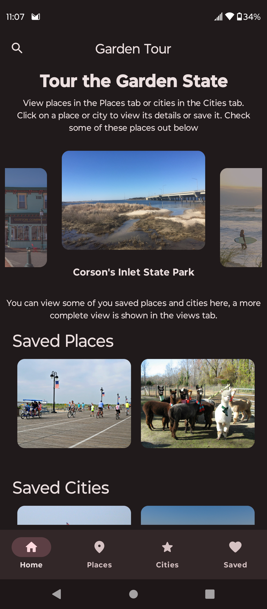
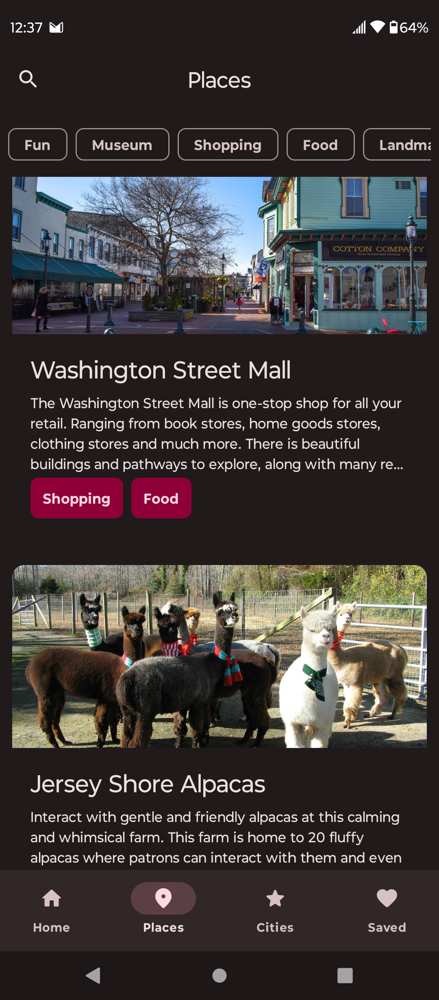
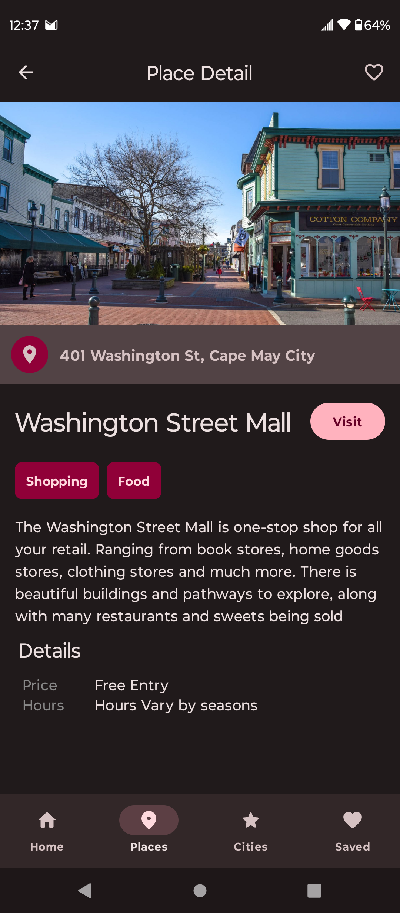
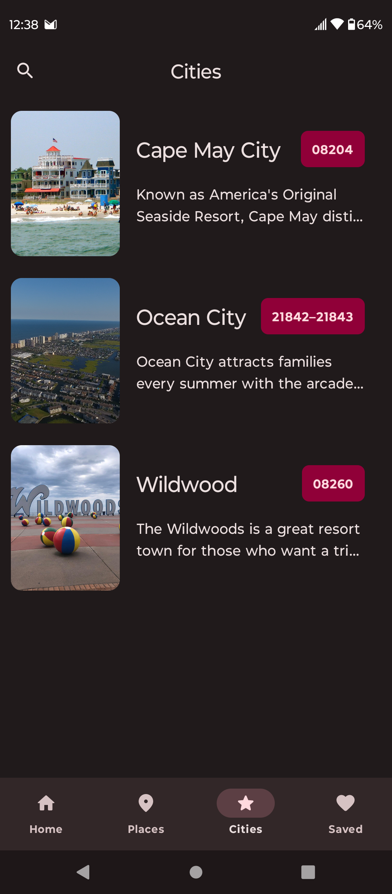
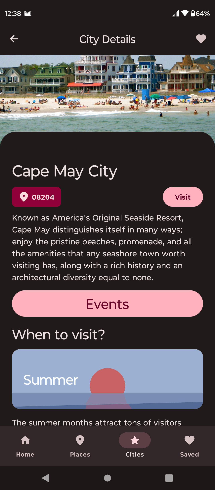
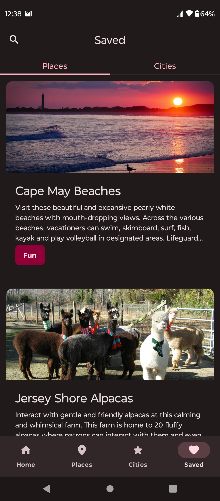

# GardenTour

> [!CAUTION]
> TSA submission project, not an actual app.

    
    
    

    
    
    

An android app written in Kotlin using Jetpack Compose to present NJ as a place for tourism.
Code architecture and design heavily inspired by Google's NowInAndroid app.

## Installing

Grab the debug apk from releases and run it.

## Features

*   Viewing places and cities
*   Saving places and cities
*   Filtering places and cities
*   Searching places

## Design

places.json and cities.json are data files which gets inserted into a database
using create.sql, which is then placed in the assets directory for prepopulating room.

The database is the datasource and source of truth for the application, all access
to data is done through sql queries and searching is done throguht sqlite's FTS4.

> [!NOTE]
> A server is likely a better choice for a datasource with the database used only as caching.
> This resolves the issue of having to run create.sql and replace database each update.

Images are fetched using coil, all data are stored as strings, though the types should be revised
and arrays should be used to indicate multiple values.

Dependency injection via Hilt is used for, well, dependencies.

## Project Structure

*   feature/: UI screens for the app, and are the features of the app (ViewModels and Jetpack Compose)
*   database/: database-related files for working with room (entites, dao)
*   datastore/: proto-datastore files (userpreferences, namely saved cities and places)
*   components/: reusable UI components
*   data/: data repositories
*   model/: data model presented through the code
*   ui/: theme, typography, and colors for Jetpack Compose
*   navigation: Jetpack Compose Navigation

## Credits

Information was from TravelNewsUS and respective websites of places and cities.
Image credits can be found in the relevant places.json and cities.json files.
NowInAndroid for reference.

